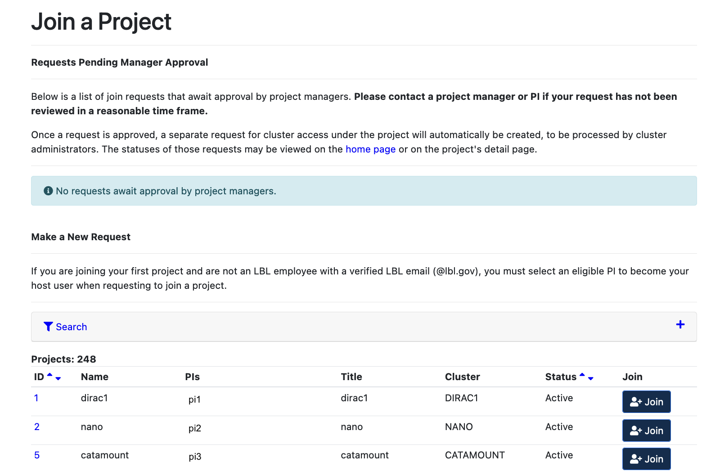
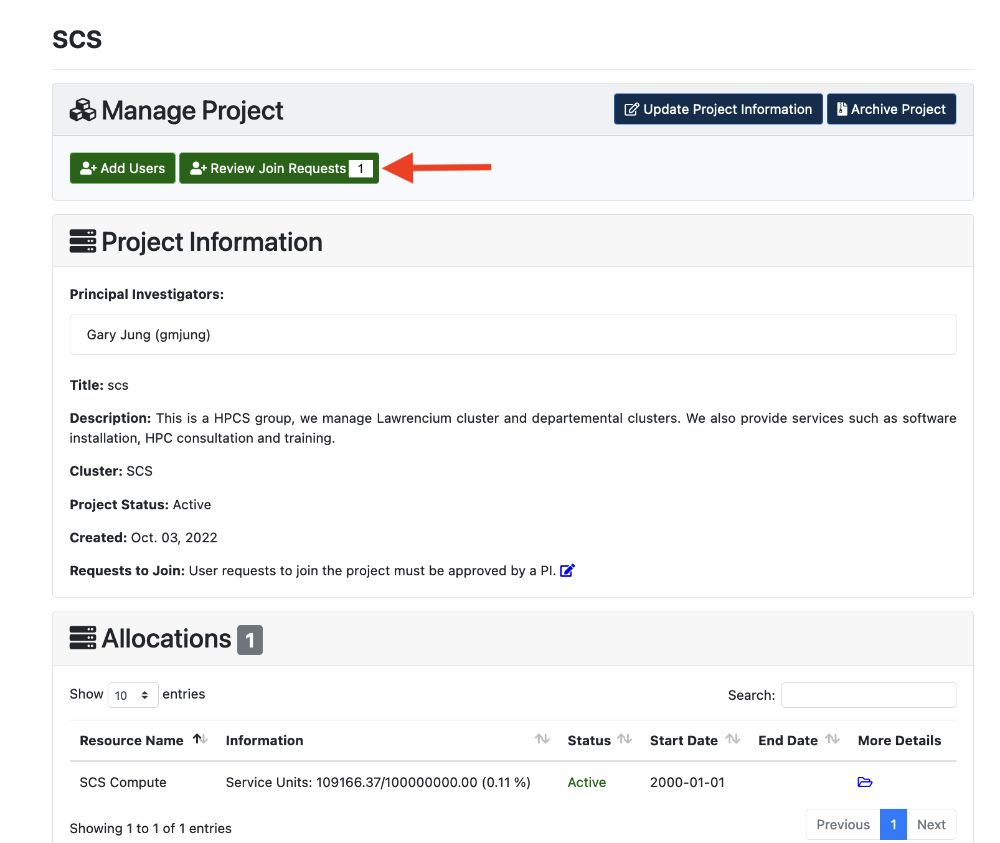
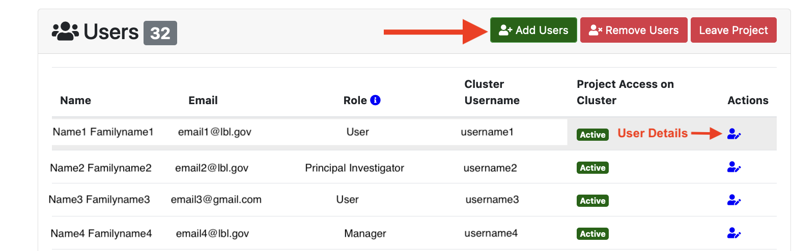
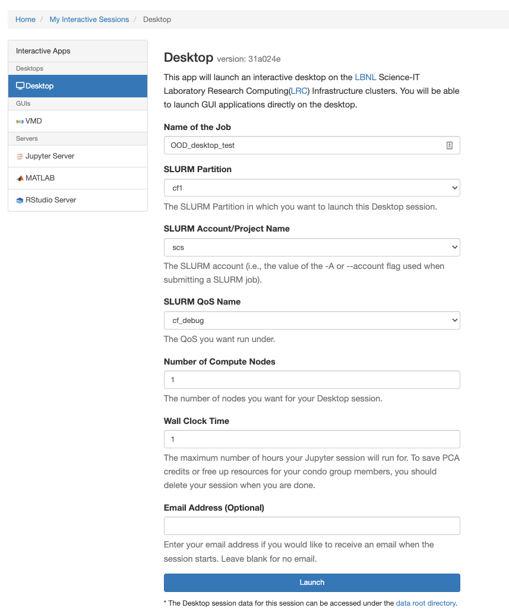

<style>section { font-size: 25px; }</style>

<!-- _class: lead -->
<!-- _paginate: false -->

# Open OnDemand on Lawrencium 
#### Sapana Soni


---

<style scoped>section { font-size: 28px; }</style>

<!-- paginate: true -->
# Outline
<style scoped>section { font-size: 26px; }</style>
1. [Introduction](#3)
2. [Accessing OOD on Lawrencium](#5)
3. [Interactive Apps: Jupyter Server, RStudio Server, MATLAB, Desktop](#7)
4. [Customizing Jupyter Kernels: Python and Julia](#13)
5. [Files: file management](#23)
6. [Clusters: LRC shell access](#25)
7. [Jobs: job management and submission](#26)

---
## Training style : mostly demonstration

- If you have account on Lawrencium then open OOD dashboard and try it yourself as we go. 
- Don't have account on Lawrencium? Don't worry! You can watch for now and try it later using training materail. 
- Training material is available on GitHub(https://github.com/lbnl-science-it/OOD_training_Feb2023.git.)
- Recording for the training will be available here[https://it.lbl.gov/resource/hpc/for-users/training-and-tutorials/]. 
- How to use Lawrencium? 
  - Documentation page [link](https://it.lbl.gov/resource/hpc/for-users/hpc-documentation/) 
---
## MyLRC User Portal: Getting and managing LRC accounts

- Getting a user account on LRC
- Getting access to project
- Requesting project account 
  - Updating Project information
  - PCA Project renewal 
  - Account deletion

MyLRC portal [login](https://mylrc.lbl.gov/)
MyLRC [Documentation](https://it.lbl.gov/service/scienceit/high-performance-computing/mylrc-lawrencium-account-management-system/)

---
# Getting a user account on LRC

**Currentl Workflow:**
1. Setup account on MyLRC [portal](https://mylrc.lbl.gov/) as LBNL affiliate/UC bErkeley affiliate or as an External collaborator
2. Sign the User Access Agreement Form 
3. Request to join existing project
4. PI approval
5. Lawrencium account creation by HPCS team
6. Users will confirmation email and PIN+OTP set up instructions.

---
**Step 1:** Use your LBNL emal accoun to login. If you don't have lbnl email accout then you can login using UC Berkeley email address or as an external collaborator.


---
## LBNL Credentails


---
## UC Berkeley Credentials


---
## External Collaborator : 
Chose your institution from the drop down menue and enter your cretials for the account. If your institution is not listed then chose google to use a google account for login.


---
**Step 2:** Sign the User Access Agreement Form 


---
**Step 3:** Request to join existing project



---
**Step 4:** Approval from Principal Investigator

PI will receive an email in following format.
```
Dear managers of ac_scsguest,

User Sapana Soni(ssoni@lbl.gov) has requested to join your project, ac_scsguest via the MyLRC User Portal.

Please approve/deny this request [here]{https://mylrc.lbl.gov/project/7/review-join-requests/}.

Thank you,
MyLRC User Portal team 
https://mylrc.lbl.gov 
Email:hpcshelp@lbl.gov
```
---
Step 5 and 6: Account creation and confirmation

```
Dear Sapana Soni,

As requested, your user account on the LRC supercluster now has access to the project ac_scsguest.

Your LRC supercluster username is - viraat

Instructions on how to access the LRC supercluster, hardware details, 
filesystems, job scheduler etc... are all available at this user guide: 
https://it.lbl.gov/service/scienceit/high-performance-computing/lrc/

If this is the first time you are accessing the LRC supercluster, start with the below 
Logging In page: https://it.lbl.gov/resource/hpc/for-users/getting-started/

Please review online documentation. For any additional help or support questions
contact us at hpcshelp@lbl.gov

Thank you,

MyLRC User Portal team
https://mylrc.lbl.gov
Email : hpcshelp@lbl.gov
```

---
### Getting access to project: 
Once you get a user account on MyLRC portal and on lawrencium cluster, you can request to join other porjects. You can follow steps 3-6 from [Getting a user account on LRC](#5). 


---
### User account Features: Center Summary and Project


---
### User account Features: Request and Jobs


---

### User account Features: Jobs


---
### Requesting project account and management
LBNL affiliated PIs can request to create a project account. Manager role can be assigned to a project user for managing project account and project renewal (for PCA projects)


---


---


---


---


---
Project creation request will be placed when survey is filled and submitted. Current status of the project will be available in Requests section.


---
PI receives an email upon processing the project creation request.

Example email:

```
Dear LRC HPC Resources user,

Your request to create project pc_test has been processed, and the project has been set up on the cluster.

You may manage your project at  https://mybrc.brc.berkeley.edu/project/<project_number>/

If you have any questions, contact us at {{ hpcshelp@lbl.gov }}.

Thank you,
MyLRC User Portal team
https://mylrc.lbl.gov
Email : hpcshelp@lbl.gov
```

---
### Project Management


---


<style scoped>section { font-size: 22px; }</style>

**Project Information**: Project information can be modified using Update Project Information button. 
**Note:** PID change is not possible on the portal. PI/manager will have to open a ticket by sending an email to hpcshelp@lbl.gov with project name and new PID.


---
**Project Join Requests from users**



---
**PCA Project Renewal**: PCA projects are renewed every year on 1st October and 300K SU are allocated for the Fiscal year. Condo(lr_) and reachrge accounts(ac_) won't have this option since these project do not need renwal. 


---
Existing Project users and their details. 
Managers or PIs can add user to project account.



---
**User Deletion**
1. Remove users from project
   User can request to leave the project or PI/manager can request removing users from the project on MyLRC portal. After removal from project user won't be able to submit jobs using that project account.
2. Remove from a project & delete user account
   Project PI will be responsible to inform HPCS team to inform about user's account deletion through ticketing system. User's account will be completely deleted from Lawrencium super cluster. A home and scratch directory will be removed. Account management charges of $25 will be canceled from billing cycle. 


---

<style scoped>section { font-size: 24px; }</style>

# Open OnDemand: Introduction 
- What is Open OnDemand?
   - OpenOnDemand is a web platform that provides an easy access to the cluster’s HPC resourses and services.  
   - Designed and developed by Ohio Supercomputer Center.
- Why OOD?
  - **New users:** intuitive and easy access to computing resourses, removes barrier in using HPC resourses for their research. 
  - **Advanced users:** alternative and convenient way to traditional command line access
  

---
<!-- _class: lead -->
<style>
footer { font-size: 20px
    }
</style>

<style scoped>section { font-size: 24px; }</style>

- How OOD works at system level? 
<style>
img[alt~="center"] {
  display: block;
  margin: 0 auto;
}
</style>


Users are able to use HPC services more efficiently through Open OnDemand. 

---

# Accessing OOD on Lawrencium

<style scoped>section { font-size: 25px; }</style>

 1. Web link to connect : [https://lrc-ondemand.lbl.gov/](https://lrc-ondemand.lbl.gov/)
**Note:** Use Chrome or Firefox to browse this page. Safari has known [authentication issues](https://osc.github.io/ood-documentation/master/issue/overview.html).


2.  Use your LRC username and PIN+one-time password (OTP)
    - same credentials you use to login Lawrencium cluster


---

### OOD Dashboard on Lawrencium
On successful authentication you will see a OOD dashboard. 


---
## Interactive Apps: Jupyter server
Click on **Interactive apps --> Jupyter Server** to open Jupyter notebook


---

Interactive mode


----

Compute mode

 


----


---


---
To load Jupyter lab simply add **lab/** before **tree/** in jupyter server url.


---
## Customizing Jupyter Kernels : Python and Julia
If you’d like to use a different language or version of python or different conda environment not indicated in the drop-down menu of jupyter notebook you’ll need to create your own kernel.

### **Python:**
There are two ways to add python kernel to jupyter notebook. 
1. Using conda environment
2. Manually creating a new kernel
   [Click here for details.](https://it.lbl.gov/resource/hpc/for-users/hpc-documentation/open-ondemand/jupyter-server/)
   
---
Customizing python kernel using conda environment

```
# Creating a pykernel for 3.9.12 version of python and installing packages
module load python/3.9.12
# Create the environment in your home directory: 
conda create --name=py39 python=3.9 ipykernel
source activate py39
python -m ipykernel install --user --name py39 --display-name="py39(Sci)"
conda install -c conda-forge scipy
```
Creating environment in scratch space: $USER is your own username.
```
conda create -p /global/scratch/users/$USER/py39_scr python=3.9 ipykernel
source activate /global/scratch/users/$USER/py39_scr
python -m ipykernel install --name=py39_scr --prefix=/global/scratch/users/$USER/py39_scr --display-name="py39_scratch"
#create sysmlink to kernel in custom path
ln -s /global/scratch/users/$USER/py39 /global/home/users/$USER/.local/share/jupyter/kernels/py39
```
You need to create a symlink in /global/home/users/$USER/.local/share/jupyter/kernels/ directory so that kernel appears in the jupyter notebook.


---
### **Julia:**
Julia kernel can be added in Jupyter for writing a Julia code in Jupyter notebook. To add a Julia kernel to Jupyter we only need to add the IJulia package.

```
module load julia/1.0.3
julia --version
julia
using Pkg
Pkg.add("IJulia")
Pkg.build("IJulia")
```

To remove unwanted jupyter kernel use following commands.

```
module load python/3.9.12
jupyter kernelspec list
jupyter kernelspec uninstall julia-1.0
jupyter kernelspec uninstall py39
```


---
## Interactive Apps: RStudio


----

Compute and interactive mode 


---
## Interactive Apps: MATLAB


---
##  Interactive Apps: Desktop 




---

## Desktop  


---
### Using Desktop to launch VMD 


---
### Using Desktop to launch ParaView


---
# Files: file management
- **Conventional approach: command line**
  - Linux file editors for editing files: vi, vim, nano, emacs
  - File transfer: scp, rsync
- **Globus for file transfer**
- **Open OnDemand: Files feature**
  - view and edit text files
  - create or rename or delete files
  - create or rename or delete directories
  - file/directory upload and download
  

---

### Files : Home directory  


---

# Clusters: LRC shell access


---
# Job submission and management


---
# Job composer and template


---
### Submission script 


---
# Jobs:  submission directory

Job composer creates a working directory by default on the path /global/home/users/spsoni/ondemand/data/sys/myjobs/projects/default
-  **Use default path:** Copy/upload all the files required for the jobs on this path before hitting Subimit button.
   -  click 'Open Dir' button at the bottom of the job script content.
   -  using a file explorer upload or transfer files


  


---
**OR**

- **Set different working directory:** If you want to use files saved on different location and would like to run job in that diectory, for example: scratch.
  - add following command line in your job script
  ````
  cd /global/scratch/users/spsoni/my_working_dir
  ````
  **Note:** Use path you aim to set for your working directory. 
---

# Log out and clean up
- Log out of the portal

- Clean up
  - The portal stores temporary files for interactive apps on the path $HOME//ondemand/data/sys/dashboard/batch_connect/sys
  - It is a good practice to clean up this directory periodically.
  ```
  rm -rf $HOME/ondemand/data/sys/dashboard/batch_connect/sys/* 
  ```

---

  # Getting help
  - Virtual office hours: 
    - Time: 10.30 am to noon every Wednesday
    - Online [request](https://docs.google.com/forms/d/e/1FAIpQLScBbNcr0CbhWs8oyrQ0pKLmLObQMFmYseHtrvyLfOAoIInyVA/viewform)
  - Send us tickets at hpcshelp@lbl.gov
  - More information about LBNL Supercluster and scientic computing services can be found [here](https://it.lbl.gov/service/scienceit/). 

Your feedback is important to us for improving HPC services and training.
Please fill out [training survey](https://docs.google.com/forms/d/1PrqmX6Y0ZO88w2_cV1LerOIkNqo8oalWhxw3lzyz3mw/edit)


---